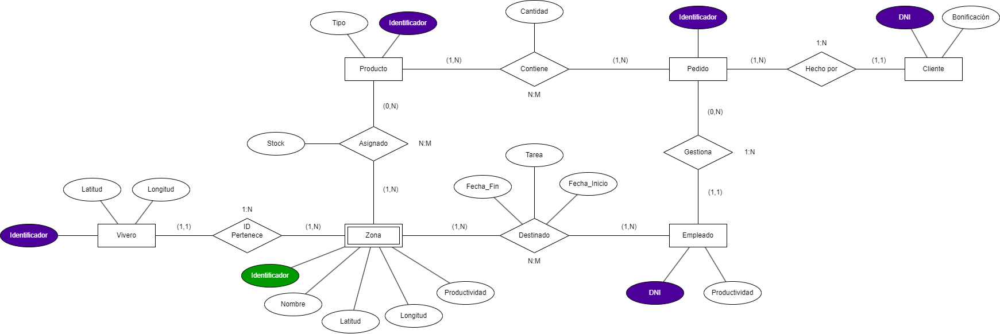

## Descripción de las Entidades

* **Vivero:** Representa cada uno de los centros de la red de viveros de la empresa Tajinaste S.A.
* **Zona:** Representa las distintas áreas que tiene internamente un vivero (por ejemplo, zona exterior, almacén, invernadero, etc.). Su existencia e identificación dependen directamente de la entidad `Vivero` a la que pertenece.
* **Producto:** Representa los artículos que comercializa la empresa (plantas, productos de jardinería y artículos de decoración).
* **Empleado:** Representa a los trabajadores de la empresa Tajinaste S.A., quienes son destinados a diferentes zonas de los viveros a lo largo del año y se encargan de gestionar los pedidos de los clientes.
* **Cliente:** Representa a los clientes registrados en el programa de fidelización *Tajinaste Plus*, a los cuales se les realiza un seguimiento de sus compras y se les asignan bonificaciones mensuales.
* **Pedido:** Representa cada una de las órdenes de compra realizadas por los clientes pertenecientes al programa *Tajinaste Plus* y gestionadas por un empleado responsable.

## Descripción y Dominio de los Atributos

### Atributos de las Entidades

| Entidad | Atributo | Tipo de Atributo | Dominio y Descripción | Ejemplo Ilustrativo |
| :--- | :--- | :--- | :--- | :--- |
| **Vivero** | `Identificador` | Identificador principal | Cadena alfanumérica única de longitud fija que identifica cada vivero. | `"VIV-001"`, `"VIV-002"` |
| | `Latitud` | Descriptor | Número real (decimal) en grados sexagesimales en el rango $[-90.0, 90.0]$. | `28.4874` |
| | `Longitud` | Descriptor | Número real (decimal) en grados sexagesimales en el rango $[-180.0, 180.0]$. | `-16.3159` |
| **Zona** | `Identificador` | Discriminante | Código alfanumérico que identifica de forma única a una zona dentro de un mismo vivero (junto con el `Identificador` de `Vivero` forma la clave primaria). | `"Z-01"`, `"Z-02"` |
| | `Nombre` | Descriptor | Cadena de caracteres que describe el propósito o área de la zona. | `"Zona Exterior"`, `"Almacén"` |
| | `Latitud` | Descriptor | Número real (decimal) en el rango $[-90.0, 90.0]$ para georreferenciar la zona. | `28.4876` |
| | `Longitud` | Descriptor | Número real (decimal) en el rango $[-180.0, 180.0]$ para georreferenciar la zona. | `-16.3161` |
| | `Productividad` | Descriptor / Calculado | Valor numérico real (porcentaje o índice de rendimiento $\ge 0$) que mide la productividad de la zona. | `87.5` |
| **Producto** | `Identificador` | Identificador principal | Código alfanumérico único (SKU) que identifica cada producto del catálogo. | `"PROD-1045"` |
| | `Tipo` | Descriptor | Cadena de caracteres perteneciente al conjunto `{Planta, Jardinería, Decoración}`. | `"Planta"`, `"Jardinería"` |
| **Empleado** | `DNI` | Identificador principal | Cadena de 9 caracteres (8 dígitos y 1 letra mayúscula de control) que identifica al trabajador. | `"45678912A"` |
| | `Productividad` | Descriptor / Calculado | Valor numérico real ($\ge 0$) que refleja el rendimiento y logro de objetivos de venta del empleado. | `92.0` |
| **Pedido** | `Identificador` | Identificador principal | Código alfanumérico único que identifica cada pedido registrado en el sistema. | `"PED-2026-0089"` |
| **Cliente** | `DNI` | Identificador principal | Cadena de 9 caracteres (8 dígitos y 1 letra mayúscula) que identifica unívocamente al cliente *Tajinaste Plus*. | `"78912345B"` |
| | `Bonificación` | Descriptor / Calculado | Valor numérico real ($\ge 0$, expresado en euros o porcentaje de descuento) asignado según el volumen de compras mensual. | `15.50` |

### Atributos de las Relaciones

| Relación | Atributo | Tipo de Atributo | Dominio y Descripción | Ejemplo Ilustrativo |
| :--- | :--- | :--- | :--- | :--- |
| **Asignado** | `Stock` | Descriptor | Número entero no negativo ($\ge 0$) que indica la cantidad de unidades disponibles de un producto concreto en una zona determinada. | `45` |
| **Destinado** | `Fecha_Inicio` | Descriptor | Fecha (formato `AAAA-MM-DD`) en la que el empleado comienza a trabajar en una zona. | `"2026-03-01"` |
| | `Fecha_Fin` | Descriptor | Fecha (formato `AAAA-MM-DD`, o valor nulo si sigue activo) en la que finaliza su destino en dicha zona. | `"2026-08-31"` |
| | `Tarea` | Descriptor | Cadena de texto que describe el puesto o labor desempeñada por el empleado en esa zona durante ese periodo. | `"Mantenimiento de riego"`, `"Ventas"` |
| **Contiene** | `Cantidad` | Descriptor | Número entero positivo ($> 0$) que indica el número de unidades de un producto incluidas en un pedido. | `3` |

## Descripción de las Relaciones y Cardinalidades

1. **Pertenece (`Vivero` — `Zona`) | Cardinalidad `1:N`**
   * **Descripción:** Vincula cada zona con el vivero físico en el que se encuentra ubicada. Al ser `Zona` una entidad débil en identificación, necesita el `Identificador` de `Vivero`.
   * **Participaciones:**
     * **Vivero `(1,N)`** (situado junto a `Zona`): Todo vivero se divide como mínimo en 1 zona y como máximo en `N` zonas.
     * **Zona `(1,1)`** (situado junto a `Vivero`): Cada zona pertenece única y exclusivamente a 1 vivero.

2. **Asignado (`Zona` — `Producto`) | Cardinalidad `N:M`**
   * **Descripción:** Representa la distribución y disponibilidad (`Stock`) de los productos dentro de las diferentes zonas de los viveros.
   * **Participaciones:**
     * **Zona `(0,N)`** (situado junto a `Producto`): Una zona puede no tener productos asignados (mínimo 0) o tener varios productos distintos asignados (máximo `N`).
     * **Producto `(1,N)`** (situado junto a `Zona`): Todo producto registrado está asignado al menos a 1 zona y puede estar distribuido en múltiples zonas (`N`).

3. **Destinado (`Zona` — `Empleado`) | Cardinalidad `N:M`**
   * **Descripción:** Recoge el seguimiento histórico de los puestos de trabajo (`Tarea`, `Fecha_Inicio`, `Fecha_Fin`) que desempeñan los empleados en las distintas zonas a lo largo del tiempo.
   * **Participaciones:**
     * **Zona `(1,N)`** (situado junto a `Empleado`): En una zona trabaja como mínimo 1 empleado y pueden trabajar varios empleados (`N`) a lo largo del tiempo.
     * **Empleado `(1,N)`** (situado junto a `Zona`): Todo empleado es destinado al menos a 1 zona y puede pasar por varias zonas (`N`) en diferentes épocas del año.

4. **Gestiona (`Pedido` — `Empleado`) | Cardinalidad `1:N`**
   * **Descripción:** Asocia cada pedido realizado por un cliente *Tajinaste Plus* con el único empleado responsable de su gestión.
   * **Participaciones:**
     * **Pedido `(1,1)`** (situado junto a `Empleado`): Cada pedido tiene obligatoriamente 1 único empleado responsable (mínimo 1, máximo 1).
     * **Empleado `(0,N)`** (situado junto a `Pedido`): Un empleado puede no haber gestionado ningún pedido (mínimo 0) o gestionar múltiples pedidos (máximo `N`).

5. **Hecho por (`Pedido` — `Cliente`) | Cardinalidad `1:N`**
   * **Descripción:** Vincula a los clientes del programa de fidelización *Tajinaste Plus* con el histórico de pedidos que han realizado desde su ingreso en el programa.
   * **Participaciones:**
     * **Pedido `(1,1)`** (situado junto a `Cliente`): Todo pedido es realizado por 1 único cliente (mínimo 1, máximo 1).
     * **Cliente `(1,N)`** (situado junto a `Pedido`): Un cliente registrado realiza desde 1 hasta `N` pedidos.

6. **Contiene (`Producto` — `Pedido`) | Cardinalidad `N:M`**
   * **Descripción:** Detalla qué productos conforman cada pedido y en qué `Cantidad`.
   * **Participaciones:**
     * **Producto `(1,N)`** (situado junto a `Pedido`): Un producto figura en 1 o varios pedidos (`N`).
     * **Pedido `(1,N)`** (situado junto a `Producto`): Todo pedido contiene al menos 1 producto y puede incluir múltiples productos distintos (`N`).

## Restricciones Semánticas (De Integridad)

1. **Múltiples destinos simultáneos para un empleado:**  
   Un empleado nunca puede tener dos destinos activos al mismo tiempo. Por tanto, para un mismo `DNI` de `Empleado` en la relación `Destinado`, los intervalos temporales definidos por `[Fecha_Inicio, Fecha_Fin]` no pueden solaparse entre sí, ni puede existir más de una ocurrencia con `Fecha_Fin` nula.
2. **Control de disponibilidad de Stock en Pedidos:**  
   La `Cantidad` solicitada de un `Producto` en la relación `Contiene` no puede superar la suma del `Stock` disponible de dicho producto en las zonas (`Asignado`).
